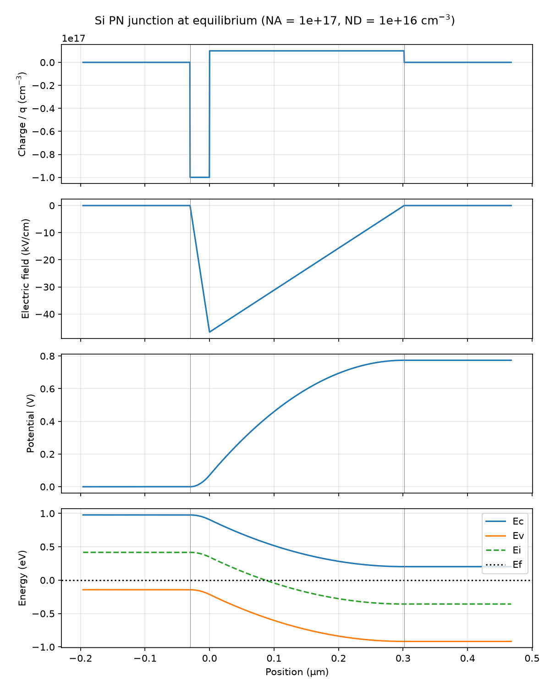
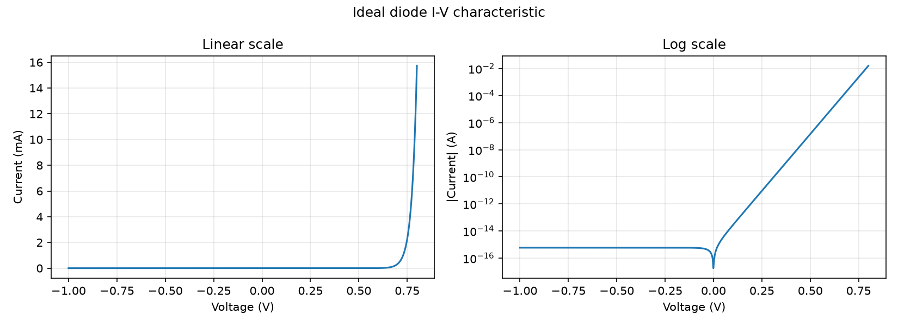
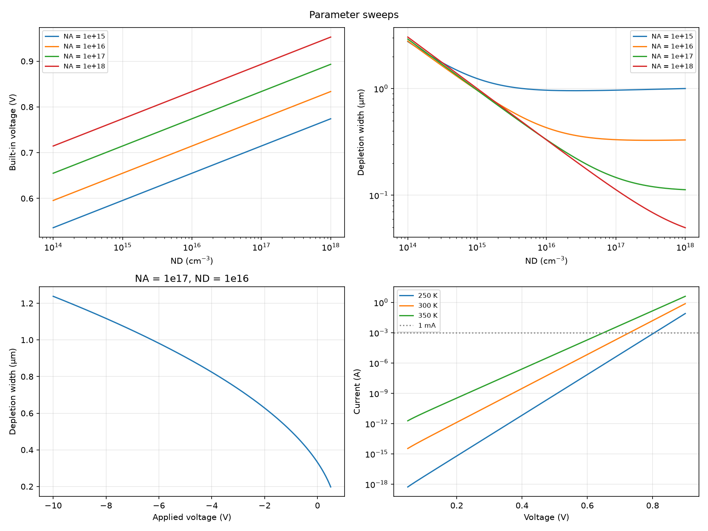
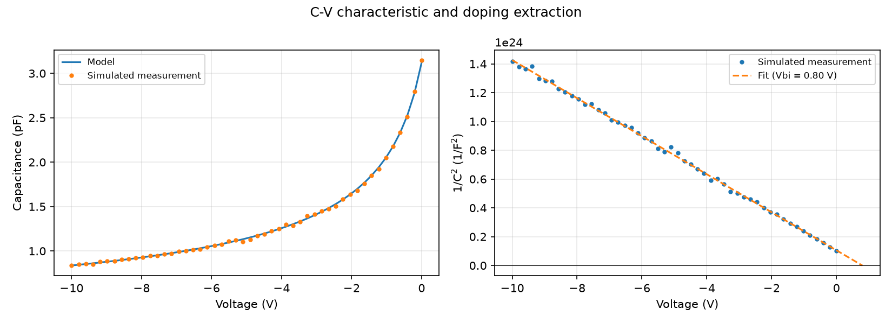

# pn-junction-simulator
# PN Junction Simulator

A Python simulator for silicon PN junctions that models electrostatics, energy band diagrams, and diode I-V and C-V behavior, with interactive sliders for doping and temperature.



## Features

- Built-in voltage, depletion width, and peak electric field for any doping level
- Charge density, electric field, potential, and energy band diagrams at equilibrium
- Ideal diode I-V characteristics on linear and log scales
- Parameter sweeps across doping (10¹⁴ to 10¹⁸ cm⁻³), reverse bias, and temperature (250 K to 350 K)
- C-V analysis with doping and built-in voltage extraction from simulated measurement data
- Interactive Jupyter notebook with sliders for NA, ND, and temperature

## Physics

Built-in voltage:

$$V_{bi} = \frac{kT}{q}\ln\left(\frac{N_A N_D}{n_i^2}\right)$$

Depletion width (V = applied voltage):

$$W = \sqrt{\frac{2\varepsilon_s (V_{bi} - V)}{q}\left(\frac{N_A + N_D}{N_A N_D}\right)}$$

Ideal diode equation:

$$I = I_0\left[\exp\left(\frac{V}{nV_t}\right) - 1\right], \quad I_0 = qAn_i^2\left(\frac{D_n}{L_n N_A} + \frac{D_p}{L_p N_D}\right)$$

Junction capacitance:

$$C_j = \frac{\varepsilon_s A}{W}$$

## Results

Default device: silicon at 300 K, NA = 10¹⁷ cm⁻³, ND = 10¹⁶ cm⁻³, area = 10⁻⁴ cm².

| Quantity | Result |
| --- | --- |
| Built-in voltage | 0.774 V |
| Depletion width | 0.332 µm (0.030 µm p-side, 0.302 µm n-side) |
| Peak electric field | 46.7 kV/cm |
| Saturation current I0 | 5.78 × 10⁻¹⁶ A |
| Forward voltage at 1 mA | 0.729 V |
| Zero-bias capacitance | 3.12 pF |







## Validation

- **Charge neutrality:** NA × xp equals ND × xn (both about 3.0 × 10¹² cm⁻²), as required.
- **I-V slope:** the forward current rises by 10× every 59.6 mV at 300 K, which matches the theoretical 2.303 kT/q.
- **C-V extraction:** from simulated data with 1% random noise, a linear fit of 1/C² recovered ND within 0.4% and Vbi within 3.2%. The larger Vbi error comes from extrapolating the fit beyond the measured range.
- **Temperature:** the forward voltage at 1 mA drops from 0.806 V at 250 K to 0.650 V at 350 K (about 1.6 mV/K). Real silicon diodes show about 2 mV/K, because this model holds the diffusion coefficients constant.

## Assumptions and limitations

- Abrupt junction with the depletion approximation
- Non-degenerate doping, with the intrinsic level at midgap
- Constant diffusion coefficients (Dn = 20 cm²/s, Dp = 10 cm²/s) and lifetime (τ = 1 µs)
- Ideal diode behavior, with no series resistance or recombination current in the depletion region
- The band diagram is shown at 300 K; temperature affects the I-V calculations only

## How to run

```
git clone https://github.com/katieraworth/pn-junction-simulator.git
cd pn-junction-simulator
pip install -r requirements.txt
python plots.py
```

For the interactive version, open `pn_junction.ipynb` in VS Code or Jupyter and run both cells.

## Project structure

| File | Purpose |
| --- | --- |
| `constants.py` | Physical constants and silicon material parameters |
| `physics.py` | Device physics equations |
| `plots.py` | Plotting functions for all figures |
| `pn_junction.ipynb` | Interactive notebook with sliders |

## Author

Katie Raworth